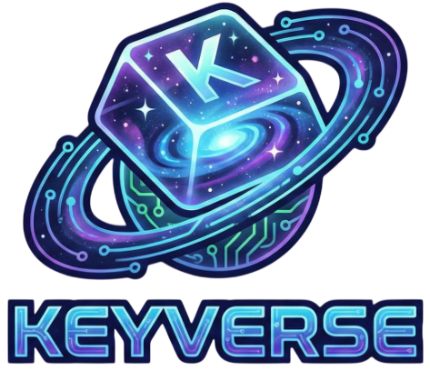
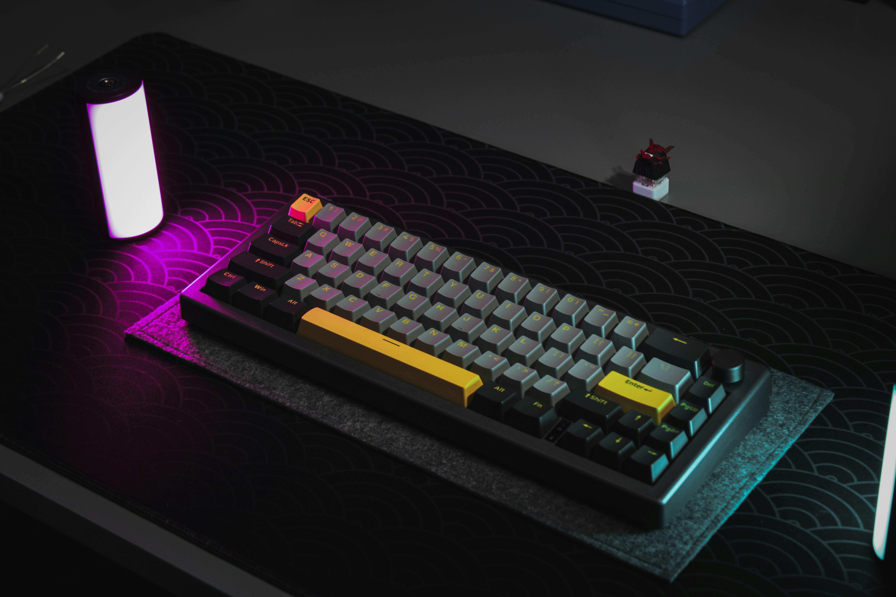

# 🎹 Odin Landing Page 프로젝트 피드백

> **평가 기준**: [The Odin Project - Landing Page](https://www.theodinproject.com/lessons/foundations-landing-page) 과제 요구사항

---

## ✅ 잘한 점 (Strengths)

### 1. **과제 요구사항 충족**
- 4개의 메인 섹션(Hero, Information, Quote, CTA) + Footer 구조를 정확히 구현했습니다.
- Flexbox를 적절히 활용하여 레이아웃을 구성했습니다.
- 자신만의 컨텐츠(키보드 랜딩페이지)로 개성 있게 커스터마이징했습니다.

### 2. **HTML 구조**
- 시맨틱 태그(`<header>`, `<section>`, `<nav>`, `<footer>`)를 올바르게 사용했습니다.
- 각 섹션에 의미 있는 `id` 값을 부여하여 가독성이 좋습니다.
- `lang="ko"` 속성을 한국어 텍스트에 적용한 점이 접근성 측면에서 훌륭합니다.

### 3. **CSS 설계**
- Google Fonts(Roboto)를 올바르게 import하여 사용했습니다.
- `box-sizing: border-box`를 전역으로 설정한 점이 좋습니다.
- `.layout`과 `.container` 클래스로 재사용 가능한 레이아웃 시스템을 구축했습니다.
- 버튼에 hover/active 상태 전환 효과를 추가하여 UX를 향상시켰습니다.

### 4. **색상 팔레트**
- The Odin Project에서 제공한 색상 가이드를 잘 따랐습니다:
  - 다크 배경: `#1F2937` ✅
  - 버튼 색상: `#3882F6` ✅
  - 텍스트 색상: `#F9FAF8`, `#E5E7EB` ✅

---

## 🔧 개선 가능한 점 (Areas for Improvement)

### 1. **HTML 문법 오류**
```html
<!-- 현재 코드 (line 16) -->


<!-- 수정 권장 -->

```
- 쉼표(`,`)가 속성 사이에 불필요하게 들어가 있습니다.
- 모든 `` 태그에 `alt` 속성을 추가하면 접근성이 향상됩니다.

### 2. **이미지 alt 속성 누락**
현재 모든 이미지에 `alt` 속성이 없습니다:
```html
<!-- 수정 권장 예시 -->


```

### 3. **네비게이션 링크**
```html
<li><a href="">Switch Lab</a></li>
```
- 빈 `href=""` 대신 `href="#"` 또는 실제 링크를 사용하는 것이 좋습니다.

### 4. **CSS 최적화 가능한 부분**

#### 4-1. Reset 스타일 순서
```css
/* 현재: body가 먼저, * 선택자가 나중 */
body { box-sizing: border-box; }
* { box-sizing: border-box; }

/* 권장: Reset을 먼저 선언 */
* { box-sizing: border-box; }
body { ... }
```

#### 4-2. Transition 오타
```css
/* line 277 - 현재 */
transition: all 0.2 ease;

/* 수정 필요 */
transition: all 0.2s ease;  /* 's' 누락 */
```

### 5. **Quote 섹션 마크업**
인용문에는 `<blockquote>` 태그가 더 시맨틱합니다:
```html
<!-- 현재 -->
<h2>"The search for the 'Endgame'..."</h2>

<!-- 권장 -->
<blockquote>
    <p>"The search for the 'Endgame'..."</p>
    <cite>- John Doe</cite>
</blockquote>
```

### 6. **버튼 요소**
```html
<!-- 현재 -->
<button class="btn-signup">Sign up</button>

<!-- 폼과 연결되지 않은 버튼이라면 -->
<a href="#" class="btn-signup">Sign up</a>
<!-- 또는 type 명시 -->
<button type="button" class="btn-signup">Sign up</button>
```

---

## 💡 추가 권장사항 (Nice to Have)

### 1. **반응형 디자인**
> *참고: The Odin Project 과제에서는 반응형이 필수가 아니지만, 향후 학습을 위해 알아두면 좋습니다.*

현재 고정 퍼센트 너비(`width: 40%`, `width: 90%` 등)를 사용하고 있어 모바일에서 레이아웃이 깨질 수 있습니다.

### 2. **이미지 파일명**
- 공백이 포함된 파일명(`Magnetic Switch.png`)은 URL 인코딩 문제를 일으킬 수 있습니다.
- 권장: `magnetic-switch.png` (소문자 + 하이픈)

### 3. **README.md 보완**
이미지 출처와 크레딧을 README에 명시하면 좋습니다 (The Odin Project 권장사항).

---

## 📊 총평

| 항목 | 평가 |
|------|------|
| 과제 요구사항 충족 | ⭐⭐⭐⭐⭐ |
| HTML 구조 | ⭐⭐⭐⭐ |
| CSS/Flexbox 활용 | ⭐⭐⭐⭐⭐ |
| 접근성(a11y) | ⭐⭐⭐ |
| 코드 가독성 | ⭐⭐⭐⭐ |

**전체적으로 The Odin Project Landing Page 과제의 핵심 요구사항을 충실히 이행했습니다!** 

특히 자신만의 콘텐츠(키보드 테마)로 창의적으로 재해석한 점과, 버튼 인터랙션에 신경 쓴 점이 인상적입니다. 위에서 언급한 마이너한 개선점들은 코드 품질을 한 단계 더 높이는 데 도움이 될 것입니다.

**다음 단계로 추천하는 학습:**
1. 이미지 접근성 (`alt` 속성)
2. 시맨틱 HTML 심화 (`<blockquote>`, `<figure>`, `<figcaption>`)
3. CSS 반응형 디자인 (media queries)

---

*피드백 작성일: 2025-01-02*
